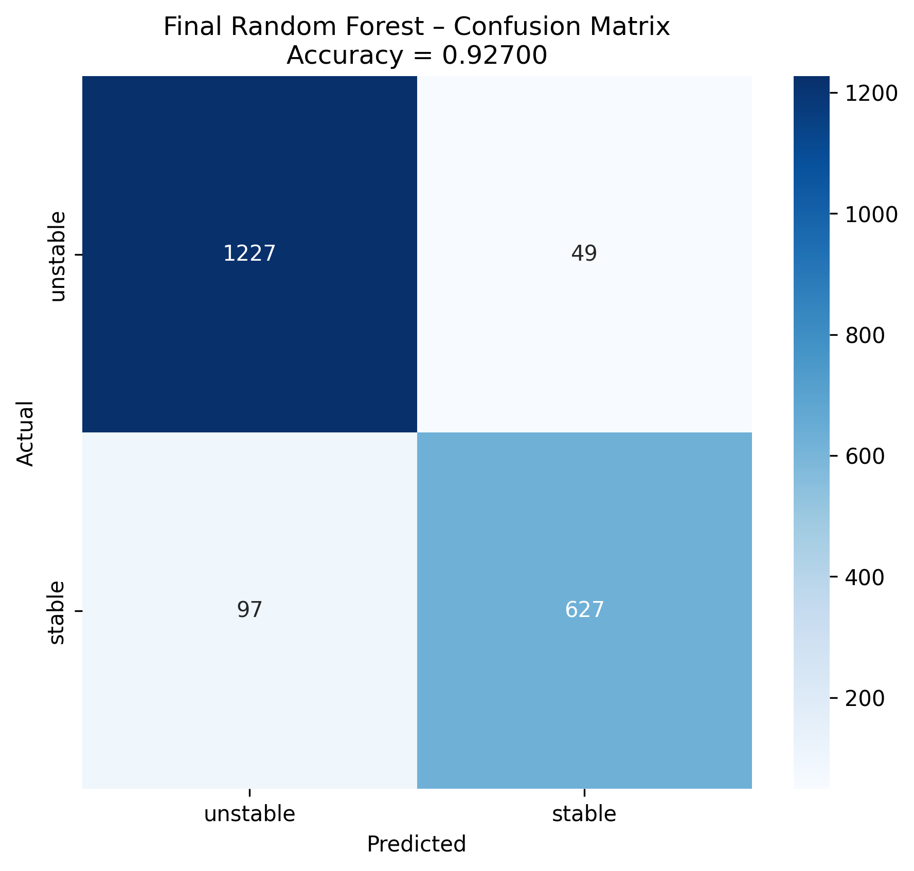

# Electrical Grid Stability Prediction  
**98.35% Test Accuracy – Tuned Random Forest**

[](LICENSE)
[](https://www.python.org)

**Best Model:** Hyperparameter-tuned Random Forest  
**Test Accuracy:** **98.35%** | F1-score: 0.983  

### Highlights
- Full pipeline on the UCI Electrical Grid Stability Simulated Dataset (10,000 samples)
- Reaction times (`tau1`–`tau4`) are the dominant predictors
- All code, figures, and results 100% reproducible

### Results



### How to Run
```bash
git clone https://github.com/sandhigeethareddy/Electrical-Grid-Stability-Prediction.git
cd Electrical-Grid-Stability-Prediction
pip install -r requirements.txt
jupyter notebook Grid_Stability_Final_Publishable.ipynb
